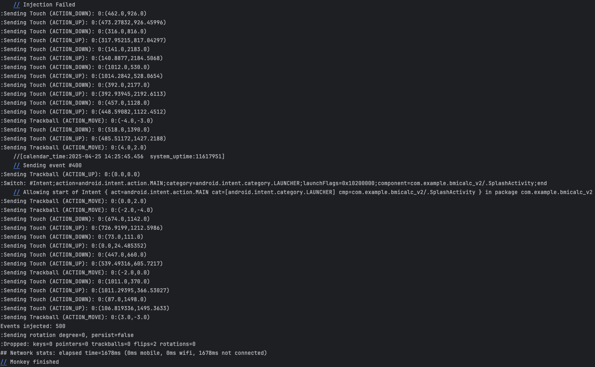
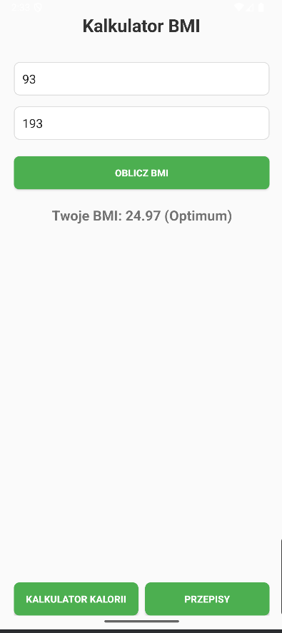
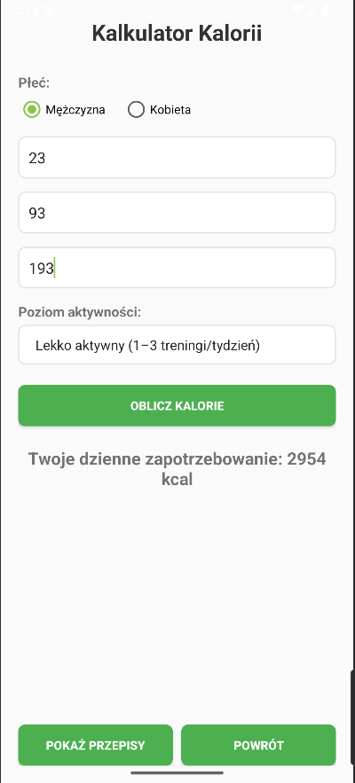
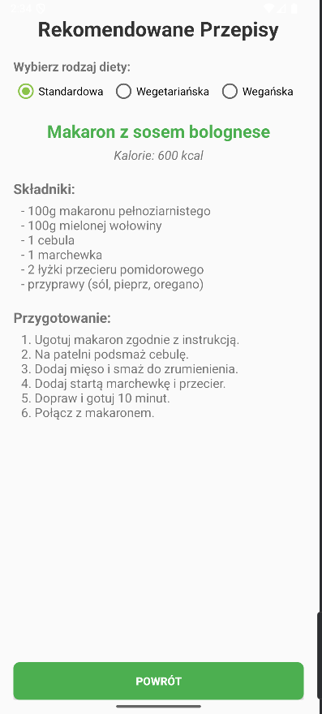

# Kalkulator BMI

Prosta aplikacja mobilna na Androida do obliczania wskaźnika masy ciała (BMI).

## Autor
Szymon Rosztajn, s25323

## Opis
Aplikacja pozwalająca obliczyć swoje BMI, zapotrzebowanie kaloryczne oraz zaproponować przepisy do danego zapotrzebowania z uwzględnieniem diety wegetraiańskiej i wegańskiej.

## Screenshot

